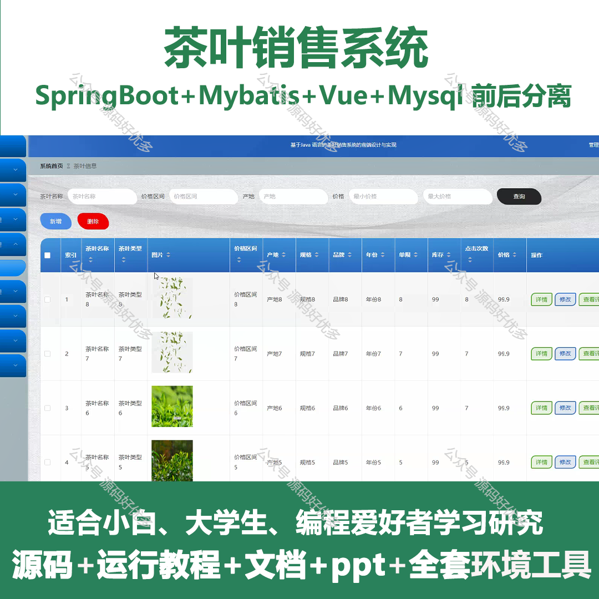
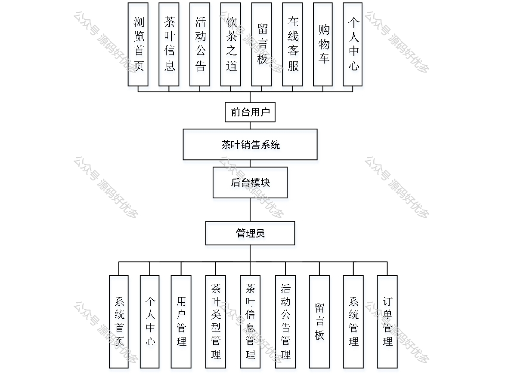
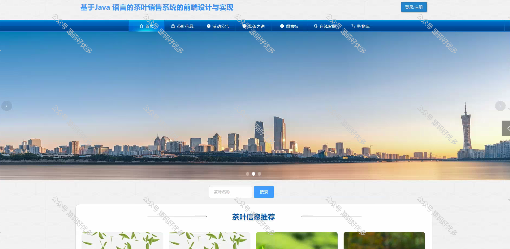
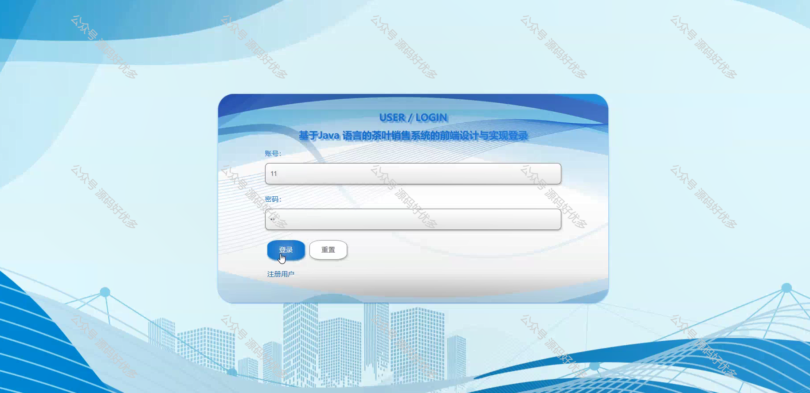
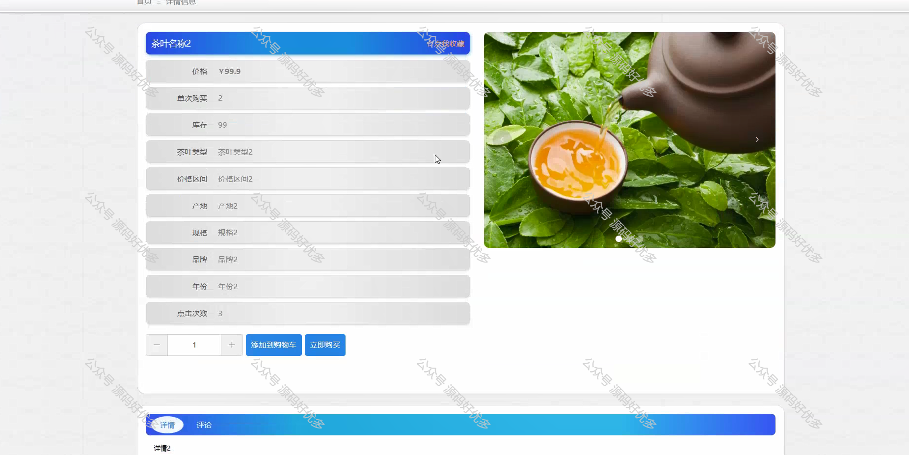
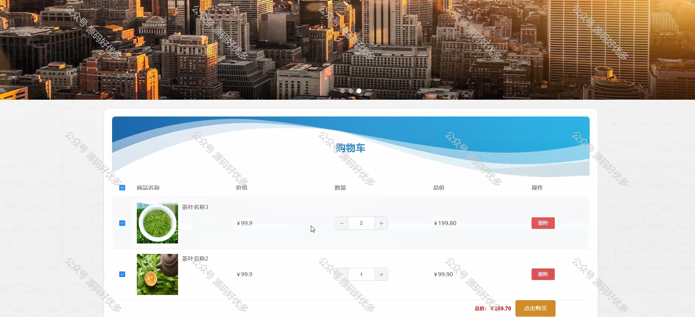
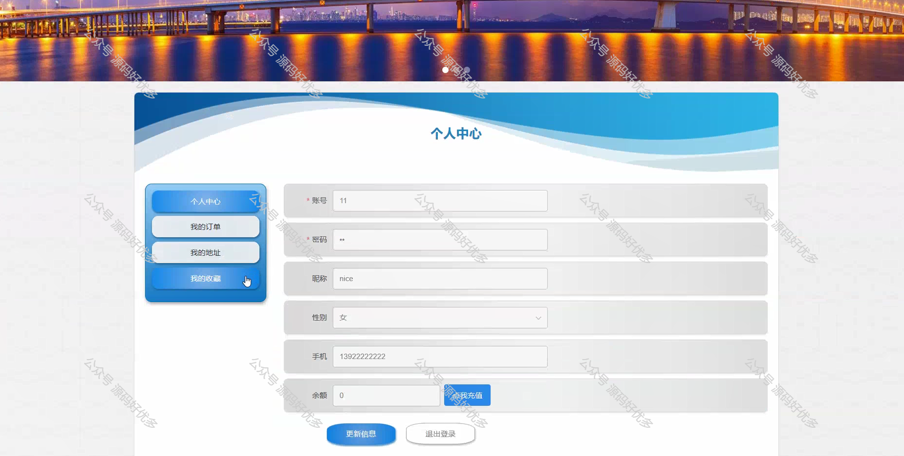
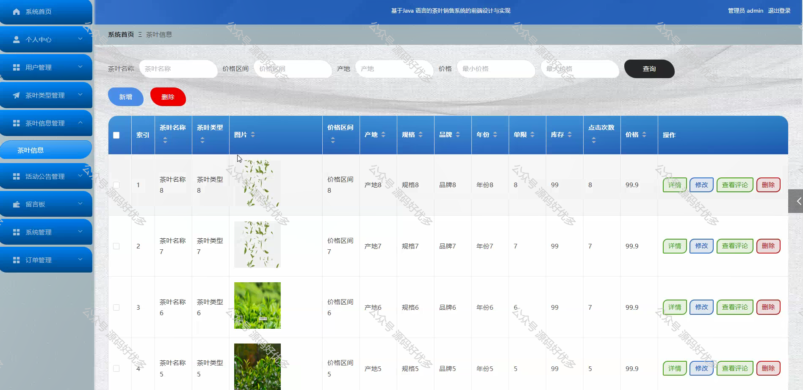
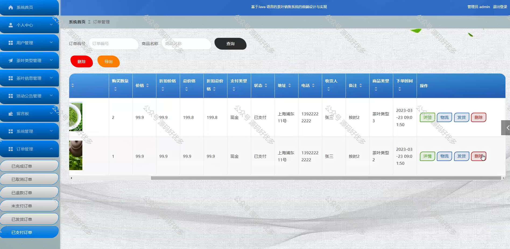
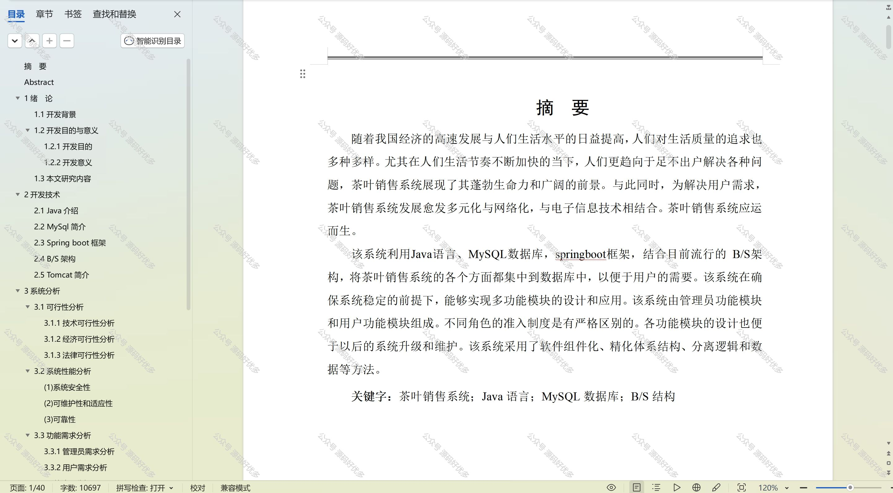

 
## 查看主页获取源码

### 一、作品包含

源码+数据库+设计文档万字+PPT+全套环境和工具资源+部署教程

### 二、项目技术

前端技术：Html、Css、Js、Vue、Element-ui

数据库：MySQL

后端技术：Java、Spring Boot、MyBatis

  

### 三、运行环境

开发工具：IDEA/eclipse

数据库：MySQL5.7

数据库管理工具：Navicat10以上版本

环境配置软件： JDK1.8+Maven3.6.3

前端Nodejs：14

### 四、项目介绍
项目编号：springbootA219

在传统茶叶市场向现代化、信息化转型的背景下，茶叶销售系统的建立显得尤为关键。它不仅能够为茶叶企业提供高效的库存管理、销售数据分析和客户关系维护等功能，还能通过线上平台拓宽销售渠道，满足消费者便捷购茶的需求，从而推动整个茶叶行业的可持续发展。

前台用户功能：浏览首页、茶叶信息、活动公告、饮茶之道、留言板、在线客服、购物车、个人中心。

后台管理员的功能：系统首页、个人中心、用户管理、茶叶类型管理、茶叶信息管理、活动公告管理、留言板、系统管理、订单管理。

### 五、运行截图

  
